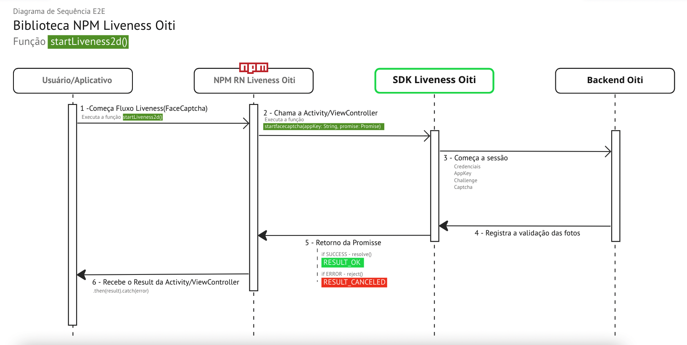
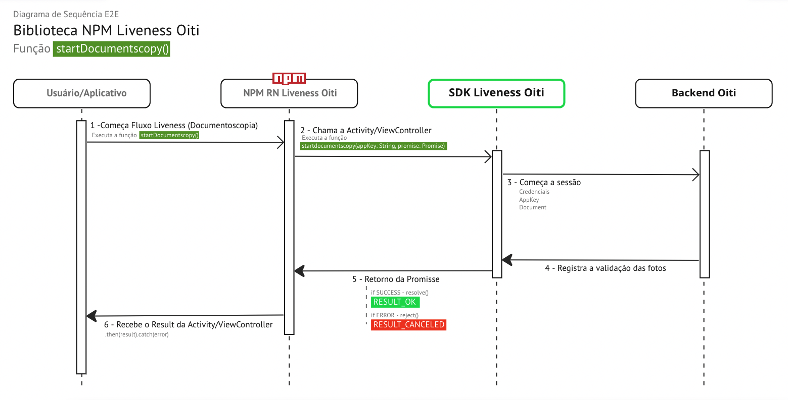

# 1. Sobre o Repositório

Este repositório é responsável pela biblioteca NPM do Liveness Oiti, com ele é possível instalar e usar as funções de FaceCaptcha e de Documentoscopia da Oititec disponíveis para aplicativos híbridos em React Native.

# 2. O que é a biblioteca?

O NPM (node package manager) é o gerenciador de pacotes do node.js (runtime de javascript).

Em primeiro lugar, com o NPM você pode gerenciar dependências do seu projeto, acessar o repositório do NPM e ter acesso a inúmeras bibliotecas e frameworks JavaScript, permite a instalação/desinstalação dos mesmos assim como a criação de seus próprios módulos públicos ou privados.

# 3. Uso (PASSO 1)

As instruções de uso, integração, implementação e customização do **Liveness Oiti** podem ser acessadas através das etapas abaixo:

## 3.1 Instalação

Usando NPM:

```sh
npm install @oiti/rn-liveness2d
```

ou usando YARN

```sh
yarn add @oiti/rn-liveness2d
```

## 3.2 iOS Configuração

Adicionar o Pod do FaceCaptcha no seu Podfile

```pod
pod 'FaceCaptcha', '~> 4.0.1', :source => 'https://github.com/oititec/liveness-ios-specs.git'
```

# 4. Uso no Javascript (PASSO 2)

Primeiro devemos chamar a função desejada da biblioteca '@oiti/rn-liveness2d'

```js
import { FUNÇÕES DESEJADAS } from '@oiti/rn-liveness2d';
```

## 4.1 Funções

#### Diagrama E2E Liveness2d



#### Diagrama E2E Documentoscopia



AppKey: gerada na etapa 2 da [documentação CertifaceID](https://certifaceid.readme.io/docs/integra%C3%A7%C3%A3o-atualizada 'Guia de Integração API v1.2')

| Função                        | Parâmetros | Retorno                    |
| ----------------------------- | ---------- | -------------------------- |
| startLiveness2d("APP KEY");   | AppKey     | RESULT_OK, RESULT_CANCELED |
| startDocumentscopy("APP KEY") | AppKey     | RESULT_OK, RESULT_CANCELED |

## 4.2 Exemplo de uso

Após efetuar a importação da biblioteca, deve ser aplicada a app Key gerada dentro do parãmetro da função desejada, no exemplo abaixo chamamos a função quando clicamos no botão "Liveness 2D" ou "Documentoscopia"

```js
export default function App() {
  const [result, setResult] = React.useState<string | undefined>();
  const appKey = 'APP KEY';

  return (
    <View>
    //Liveness2D
      <Button
        onPress={() => {
          startLiveness2d(appKey).then(setResult);
        }}
        title="Liveness 2D"
      />
    //Documentoscopia
      <Button
        onPress={() => {
          startDocumentscopy(appKey).then(setResult);
        }}
        title="Documentoscopia"
      />
    </View>
  );
}
```

# 5. Estilização (PASSO 3)

#### Liveness2D

- [(ANDROID)Guia de estilização do Liveness2D](Documentation/xmlCUSTOMIZATION.md.md);
- [(iOS)Guia de estilização do Liveness2D](Documentation/xmlCUSTOMIZATION.md.md);

#### Documentoscopia:

- [(ANDROID)Guia de estilização da Documentoscopia](Documentation/liveness3DThemeiOSCUSTOMIZATION.md);
- [(iOS)Guia de estilização da Documentoscopia](Documentation/liveness3DThemeiOSCUSTOMIZATION.md);

# 6. Como executar o clone do Repositório?

Execute o clone do repositório abaixo para clonar o código:

```sh
git clone https://github.com/oititec/liveness3d-bridge-rn
```

# 7. Como rodar o Script?

Para rodar o script desse repositório você deve instalar as dependências do projeto, então na pasta root do projeto clonado rodar o comando.

## 7.1 Yarn

```sh
yarn
```

## 7.2 Executar Projeto

> Executar sempre em dispositivos físicos e não no simulador do iOS e Android

Yarn

```sh
yarn example android
```

```sh
yarn example ios
```
